# Play Review Miner

**Rakiplerin 1–2 yıldızlı Google Play yorumlarından ürün fırsatı çıkaran açık kaynak araç.**

Bir Google Play kategorisindeki (ör. `PRODUCTIVITY`) en üstteki uygulamaları gezer, düşük puanlı yorumlarını
toplar, bunları **hata / eksik özellik / UX / fiyat-reklam / performans** temalarına ayırır ve
“insanlar en çok neye kızıyor, hangi uygulamalarda?” sorusunu cevaplayan bir **fırsat raporu** yazar.

[English README](README.md)

<p align="center"></p>

- **Temel kullanım için API anahtarı gerekmez:** herkese açık Play Store verisi
  ([`google-play-scraper`](https://github.com/JoMingyu/google-play-scraper)) + çevrimdışı anahtar kelime analizi.
- **Üç analiz motoru**
  - `keyword` (varsayılan, çevrimdışı): Türkçe + İngilizce kurallar ve kurallara uymayanlar için TF-IDF kümeleme.
  - `openai`: **OpenAI uyumlu herhangi bir uç nokta** (OpenRouter, kendi LLM gateway'iniz, yerel vLLM / Ollama /
    LM Studio). Base URL, anahtar ve model sizin seçiminiz.
  - `gemini`: Google Gemini REST API.
- **Artımlı SQLite:** tekrar çalıştırınca yalnız yeni yorumlar gelir; sonradan daha büyük örneklem isterseniz
  eski yorumlara da iner; aynı dil birden fazla ülke için taranabilir.
- **Niş mod:** büyük şirketleri atlar (`--exclude-big`), listeyi Play aramasıyla tamamlar.
- **Web paneli:** tarama/analiz başlatma, canlı ilerleme, raporlar, uç nokta ve model yönetimi, uç nokta başına
  günlük istek kotası.
- Çıktı: `reports/<KATEGORİ>_<dil>-<ülke>[_<liste>]_<motor>.md` ve `.json`. Raporlar Türkçedir.

[`reports/examples/`](reports/examples/) klasöründe **tamamen sentetik** uygulama ve yorumlarla üretilmiş bir örnek rapor var.

## Kurulum

```bash
git clone https://github.com/ZoriaSoft/play-review-miner-oss.git play-review-miner
cd play-review-miner
python3 -m venv .venv && source .venv/bin/activate
pip install -e ".[cluster]"      # cluster = TF-IDF kümeleri için scikit-learn (isteğe bağlı)
```

Python 3.9+.

## Hızlı başlangıç

```bash
# Türkiye / Türkçe, PRODUCTIVITY, ilk 20 uygulama, uygulama başına 200 düşük puanlı yorum, çevrimdışı analiz
play-review-miner run --category PRODUCTIVITY --lang tr --country tr --top 20 --reviews-per-app 200

# Adım adım
play-review-miner crawl   -c TOOLS -l tr -g tr -n 30 -r 300
play-review-miner analyze -c TOOLS -l tr -g tr -n 30
play-review-miner report  -c TOOLS -l tr -g tr -n 30 --themes 20 --since 2025-01-01
play-review-miner list-categories
```

### Niş mod (büyük şirketler hariç)

```bash
play-review-miner run -c PRODUCTIVITY -l tr -g tr --list niche \
    --exclude-big --strict-genre --min-reviews 10 --candidates 160 --top 25 -r 200
```

Geliştirici adları **tam kelime** olarak eşleşir ("apple" → "Apple Inc." evet, "Pineapple Games" hayır).
Ek isimler için `--exclude-dev`, ek arama terimleri için `--search-term`.

Tüm seçenekler ve çıkış kodları için İngilizce README'deki tabloya bakın (`play-review-miner <komut> --help` de listeler).

## Dil modeliyle analiz

```bash
export LLM_API_KEY=...                                  # anahtarı komut satırına yazmayın
export LLM_BASE_URL=https://openrouter.ai/api/v1         # varsayılan; OpenAI uyumlu her /v1 olur
play-review-miner list-models --filter deepseek/
play-review-miner run -c PRODUCTIVITY -l tr -g tr --analyzer openai --llm-model <model-id>

# Gemini
export GEMINI_API_KEY=... GEMINI_MODEL=<anahtarınızla kullanılabilen bir generateContent modeli>
play-review-miner run -c PRODUCTIVITY -l tr -g tr --analyzer gemini
```

- Yorumlar paketler halinde sınıflandırılır (kategori + 1–3 tema + tek cümlelik Türkçe özet). Yorum metni istemde
  güvenilmeyen veri olarak işaretlenir.
- Temalar çalıştırmalar arasında tutarlıdır: önceki temalar modele tercih edilen id olarak verilir, yeni id'ler
  mevcut temalara bağlanır; mevcut temaların anlamı ve etiketi değişmez.
- JSON modu otomatik: önce `json_schema`, reddedilirse `json_object`, o da yoksa istem talimatı.
- Atlanan yorumlar bir kez daha sorulur, hâlâ eksikse kaydedilmez (sonraki çalıştırma dener); kesilen yanıt
  paketi böler; 429/5xx yeniden denenir; sonuçlar 400 yorumda bir kaydedilir.
- Ücretsiz katmanların günlük kotası için `LLM_MAX_REQUESTS` (çalıştırma başına istek tavanı).
- Sonuçlar model başına (`llm-<model>`) saklanır; model değiştirmek analizleri karıştırmaz.

## Web paneli

```bash
play-review-miner panel-password        # bir kez: giriş parolası (en az 12 karakter)
play-review-miner panel --port 8765     # http://127.0.0.1:8765
```

Çalıştırma formu, iş kuyruğu (canlı ilerleme, günlük, iptal), rapor görüntüleyici ve uç nokta/model yönetimi
(modelleri uç noktadan çekme + **manuel model ekleme**, günlük istek sınırı). Varsayılan olarak yalnız
`127.0.0.1`'de dinler; dışarıya kimlik doğrulayan bir ters vekil ya da tünel (ör. Cloudflare Tunnel + Access)
arkasından açın ve `--public-host alan.adi` verin. Panelin kendi girişi, CSRF koruması ve sıkı CSP'si vardır;
anahtarlar yalnız maskeli gösterilir ve `data/panel.db` (izin 600, git dışı) içinde durur.
`CF-Connecting-IP` yalnızca tünel modunda (`--public-host` veriliyken) ve loopback bağlı tünelden gelirken
okunur — aksi halde başlık sahteciliği giriş denemesi sınırlamasını aşamaz.

## Sorumlu kullanım

- Araç, `google-play-scraper` gibi **herkese açık** Play Store sayfalarını okur. Otomatik erişim Google Play
  hizmet şartlarıyla çelişebilir; kullanım şekli ve miktarı sizin sorumluluğunuzdadır. `--delay` değerini makul tutun.
- Yorumlar kullanıcı içeriğidir. Araç **kullanıcı adı saklamaz**, ama yorum metni kişisel bilgi içerebilir.
  **Ham yorumları veya alıntılı raporları yeniden yayınlamayın**; kendi ürün araştırmanız için kullanın.
- Anahtar kelime motoru hızlı bir ilk bakıştır (ironiyi anlamaz, yanlış eşleştirebilir). Karar vermeden önce
  örnek alıntıları okuyun veya bir dil modeli motoru kullanın.
- Play sınırlı ve tam kronolojik olmayan bir örneklem döndürür; sonuçlar tüm yorumları temsil etmez.

## Geliştirme

```bash
pip install -e ".[dev]"
sh scripts/check.sh            # ruff + pytest
```

Testler ağa çıkmaz: Play Store (`tests/conftest.py` → `FakePlay`) ve LLM uç noktaları taklit edilir.
Anahtar kelime kuralı değiştirirken `tests/test_keyword.py`'ye hem doğru eşleşme hem de **bilinen yanlış eşleşme** ekleyin.

## Lisans

[MIT](LICENSE) © 2026 ZoriaSoft
